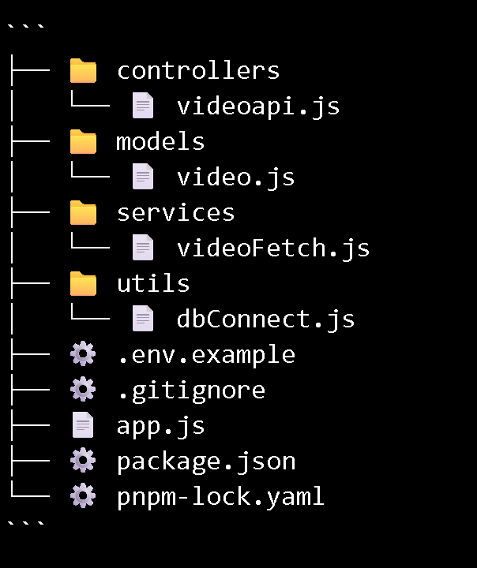
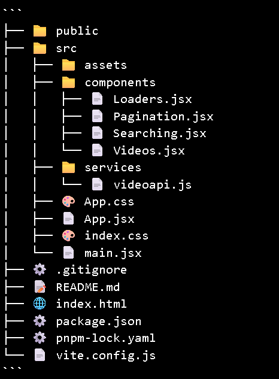

# YouTube Video Fetch API

**Project Link:** *(add link here if deployed)*

A full-stack application that continuously fetches the latest YouTube videos for a predefined search query, stores them in MongoDB, and exposes APIs to list and search videos. A simple React frontend is used to display videos with search and pagination.

---

## 🎥 Demo Video

> Below is a short demo showcasing the working application (search, thumbnails, pagination, and YouTube redirection).

https://youtu.be/ltG-L4p6V8s


## 🚀 Server Setup & Usage

1. Clone the repository.
2. Install dependencies:
   ```bash
   npm install
   # or
   pnpm install
3. Create a .env file using .env.example as reference.

4. Add your MongoDB URI and YouTube API key.

5. Start the server:

npm run start
# or
pnpm run start


## Backend Folder Structure




### Backend Highlights

Background job fetches YouTube videos at regular intervals
Data stored with proper indexes for fast sorting and search
Cursor-based pagination for scalability
Duplicate prevention using unique video IDs


## Frontend Folder Structure



## Frontend Highlights

Built with React + Vite
Connects to backend APIs
Search, pagination, and YouTube redirection supported
Clean and minimal UI